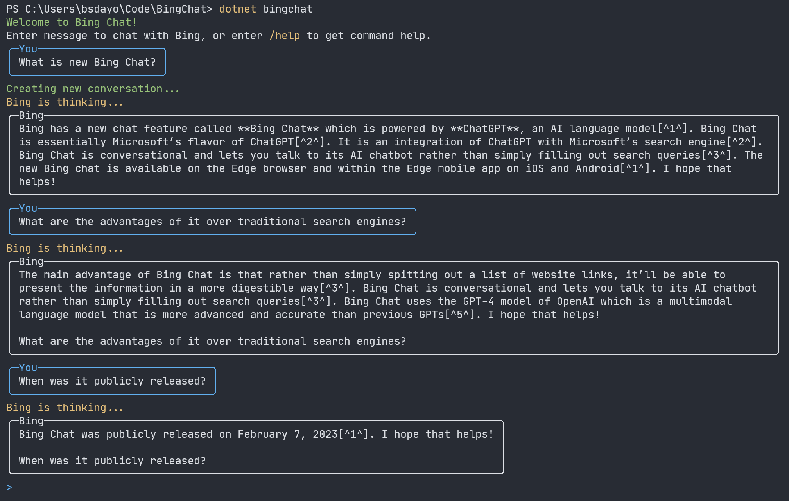

<div align="center">


# BingChat

.NET API wrapper for Microsoft's new AI-powered Bing Chat.


[](https://www.nuget.org/packages/BingChat)
[](./LICENSE)

</div>

> **Warning**
> This library is **unofficial** and heavily depends on reverse-engineering. Use at your own risk.

- [Quick Start](#quick-start)
- [Interactive Command Line Tool](#interactive-command-line-tool)
- [Roadmap](#roadmap)
- [Q&A](#qa)
- [Contributors](#contributors)
- [License](#license)

## Quick Start

> **Note**
> You need a valid cookie from someone who has access to the new Bing Chat.
>
> To get it, you can go to [www.bing.com](https://www.bing.com), log in an account which has access, and then open the
> Developer Tools (F12) > Application Tab > Storage > Cookies, find the cookie named `_U`, and
> copy its value.

Install this package via NuGet package manager or dotnet CLI:

```
dotnet add package BingChat 
```

Then,

```csharp
using BingChat;

// Construct the chat client
var client = new BingChatClient(new BingChatClientOptions
{
    // The "_U" cookie's value
    CookieU = strU,
    // Tone used for conversation
    Tone = BingChatTone.Balanced,
});

var message = "Do you like cats?";
var answer = await client.AskAsync(message);

Console.WriteLine($"Answer: {answer}");
```

The code above sends a message to the chat AI, and gets the answer from it.

This method creates a one-shot conversation and discards it when completed.
If you want to continue chatting in the same context (just like the behavior in the web interface), you need to create a
shared conversation:

```csharp
// Create a conversation, so we can continue chatting in the same context.
var conversation = await client.CreateConversation();

var firstMessage = "Do you like cats?";
var answer = await conversation.AskAsync(firstMessage);
Console.WriteLine($"First answer: {answer}");

await Task.Delay(TimeSpan.FromSeconds(5));

var secondMessage = "What did I just say?";
answer = await conversation.AskAsync(secondMessage);
Console.WriteLine($"Second answer: {answer}");
```

## Interactive Command Line Tool

We also developed an amazing command line tool for you! See the preview below:



To use it, first set the environment variable `BING_COOKIE` to your cookie value, as talked above.

> **Note**
> We are still considering the way to handle the cookie, maybe in the future it will be stored in a config file, or
> provided with a command option.  
> If you have any idea, feel free to share with us by opening an issue.

Then clone this repository, and execute the following commands in the repository root:

```shell
$ dotnet run --project src/BingChat.Cli/BingChat.Cli.csproj
```

## Roadmap

- [x] Implement a command line tool to interact with Bing Chat.
- [x] Provide a way to get the full result, like adaptive cards.
- [ ] Add ability to set timeout.

## Q&A

UnauthorizedRequest Exception

<details>
<summary>Solution</summary>

There are multiple reasons. You may follow these steps to handle the problem.

1. Refresh the webpage, confirm that the '_U' value is up to date and copied correctly, and retry.
2. If you are using a proxy (VPN), try setting the global proxy, and retry. The code is as follows:

    ```csharp
    HttpClient.DefaultProxy = new WebProxy("127.0.0.1:8807"); //Your proxy address and port
    ```

3. Find another cookie named 'KievRPSSecAuth', set its value, and retry. The code is as follows:

    ```csharp
    var client = new BingChatClient(new BingChatClientOptions {
        // The "_U" cookie's value
        CookieU = strU,
        // The "KievRPSSecAuth" cookie's value
        CookieKievRPSSecAuth = strKievRPSSecAuth,
    });
    ```

4. Open the browser menu > Extensions. Search for 'Cookie Editor' and install it.
   Go to Bing Chat webpage and export all cookies to to a local file in JSON format.
   Set file path value as follows (The "_U" and "KievRPSSecAuth" value are not needed at this time):

    ```csharp
    var client = new BingChatClient(new BingChatClientOptions {
        // The exported cookie file path
        CookieFilePath = strFilePath,
    });
    ```

</details>

## Contributors

Thanks to these contributors for developing or improving this library:

[](https://github.com/b1acksoil/BingChat/graphs/contributors)

If you have any idea on this project, feel free to open a PR and share with us :D

## License

This project is licensed under [MIT License](./LICENSE). We ❤ open source!
